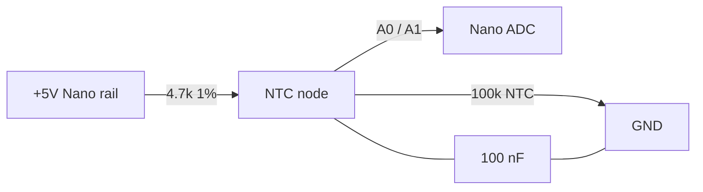
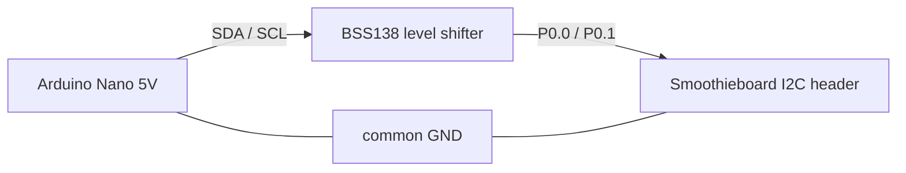

# 3d-printer-server / Klipper (Smoothieboard LPC1768) — runbook & findings (2026-09-24)

**Status: two problems fixed, one STILL OPEN.**
Fixed: the `podman-klipper` boot race (§3) and the 16-month MCU-firmware version
drift (§4). Open: the thermistor/ADC readings are implausible (§6) — that section
is written so it can be picked up cold.

---

## 1. The machine

| | |
| --- | --- |
| Host | **`3d-printer-server`** = `192.168.49.60` (static lease in `hosts/grafton-router/networking/dns.nix`) |
| Hardware | Dell OptiPlex 4770, i7-4770, 8 cores |
| Config | `machines/dell-optiplex-core-4770/` (flake host attr `3d-printer-server`) |
| autoRollback | **not enabled here** → no `nixos-confirm` needed after rebuilds |
| Board | **Smoothieboard, LPC1768** @ 100 MHz, USB CDC-ACM, 16 KiB Smoothieware/DFU bootloader |
| Serial | `/dev/serial/by-id/usb-Klipper_lpc1768_0D40001727953EAE6BC5B753C52000F5-if00` → `ttyACM0` |

Stack: three rootful podman containers, one systemd unit each —
`podman-klipper.service`, `podman-moonraker.service`, `podman-mainsail.service`.
Mainsail is served by the host's nginx on :80, so `http://192.168.49.60/` is the UI.
(`podman-fah.service` is failed/pre-existing, unrelated.)

Printer project checkout: `/home/cjdell/Projects/prind.delta` (a `mkuf/prind` fork).
Container mounts:

- `config/` → `/opt/printer_data/config` (holds `printer.cfg`)
- podman volume `prinddelta_log` → `klippy.log`, `moonraker.log`
- podman volume `prinddelta_run` → `klipper.sock`, `klipper.tty`

`printer.cfg` pins that matter:

```ini
[extruder]
heater_pin: P2.7
sensor_type: ATC Semitec 104GT-2
# sensor_pin: P0.23          <- spare ADC pin, already there as an alternative
sensor_pin: P0.25            # ADC0.2

[heater_bed]
heater_pin: P2.5
sensor_type: Honeywell 100K 135-104LAG-J01
# sensor_pin: P0.24          <- spare ADC pin
sensor_pin: P0.26            # ADC0.3
```

Both sensors use Klipper's default `pullup_resistor` of 4700 Ω. Bed limits are the
defaults `min_temp: 0 / max_temp: 130`.

## 2. Deploying config changes to this host

This host has **no GitHub credentials** (`git pull` → `Permission denied (publickey)`),
so commits travel as a git bundle:

```sh
# where the commit lives
git push origin main
git bundle create /tmp/nc.bundle <sha-currently-on-host>..main
scp /tmp/nc.bundle cjdell@192.168.49.60:/tmp/
ssh cjdell@192.168.49.60 'cd ~/nixos-config && git pull --ff-only /tmp/nc.bundle main'
```

Then rebuild **as root via nohup**, and poll it:

```sh
ssh cjdell@192.168.49.60 'cd ~/nixos-config && nohup sudo nixos-rebuild switch --flake . >/tmp/rebuild.log 2>&1 &'
```

**Gotcha:** `systemd-run --unit=… nixos-rebuild …` fails with
`error: opening Git repository "…": repository path '…' is not owned by current
user (libgit2)` — root has no gitconfig/`safe.directory` and the transient unit
lacks the login environment. `nohup sudo …` from a login shell works.
Add `--max-jobs 1` to keep the build light on this box.

## 3. FIXED — klipper container lost a boot race (every boot, ≥10 days)

**Symptom:** after a boot there is **no `klipper` container at all**
(`sudo podman ps -a` shows only `mainsail` and `moonraker`), so Moonraker has no
printer and Mainsail has nothing to show.

**Cause:** the OCI module's generated unit was ordered only after
`network-online.target`. The MCU is a USB CDC-ACM device that enumerates **~20 s
into boot** — after the container units start — so the container aborted with:

```
Error: stat /dev/ttyACM0: no such file or directory
```

and because the module sets `Restart=on-failure` with `RestartSec=100ms`, it burned
systemd's default `StartLimitBurst=5` / `StartLimitIntervalSec=10s` and latched into
`start-limit-hit` for the rest of the boot. Seen at least 10× in 10 days.

**Fix** (`machines/dell-optiplex-core-4770/3d.nix`):

```nix
systemd.services."podman-klipper" = {
  wants = [ "dev-ttyACM0.device" ];
  after = [ "dev-ttyACM0.device" ];
  unitConfig = { StartLimitIntervalSec = 300; StartLimitBurst = 30; };
  serviceConfig.RestartSec = 5;
};
```

Verified live: `After=… dev-ttyACM0.device`, `StartLimitIntervalUSec=5min`, and the
unit survived an activation restart — the exact case that used to fail.

Recovery without a rebuild: `sudo systemctl reset-failed podman-klipper && sudo systemctl start podman-klipper`.

## 4. MCU firmware updates — `klipper-firmware-update`

**Why it exists.** The klipper container tracks the floating **`latest`** tag (the
upstream README is explicit that it may move within 24 h) and podman re-pulls it on
every container start. So host-side Klipper changes **silently**, while the firmware
actually flashed into the MCU only changes when someone does it by hand. On
2026-09-24 the host was `v0.13.0-770-gce7002bed` while the MCU still ran a build
from **2025-05-25** — ~16 months of drift.

Installed by `machines/dell-optiplex-core-4770/klipper-firmware.nix`
(`writeShellApplication`, so podman/jq/curl stay on `PATH` under `sudo`); the script
source is `klipper-firmware-update.sh` beside it. It derives the target version from
the image label `org.prind.image.version`, so host and MCU can no longer drift.

```sh
sudo klipper-firmware-update --status                          # image / host / MCU versions
sudo klipper-firmware-update                                   # build only
sudo klipper-firmware-update --to-sd /run/media/$USER/<card>    # build + write firmware.bin
sudo klipper-firmware-update --flash                           # build + flash over USB DFU
```

Build: `make olddefconfig && make -j$(nproc)` inside
`mkuf/klipper:<version>-tools`, with the host bind-mounting
`config/build.smoothieboard.config` → `/opt/klipper/.config` and
`out-smoothieboard/` → `/opt/klipper/out`. The seed config pins only the board
selection; `olddefconfig` fills the rest, yielding `CONFIG_MCU="lpc1768"`,
`CONFIG_LPC_USB=y`, `CONFIG_FLASH_APPLICATION_ADDRESS=0x4000` (16 KiB bootloader),
`ADC_MAX=4095`, `CLOCK_FREQ=100000000`.

**Traps learned the hard way:**

- **Do not use `config/build.config`.** It is a stale **RP2040** config left over
  from an unrelated build (`out/board → src/rp2040`) and would produce firmware for
  the wrong MCU.
- **Never `make clean`.** It runs `rm -rf $(OUT)` and `$(OUT)` is a bind-mount point:
  `rm: cannot remove 'out/': Device or resource busy`. The script wipes the output
  dir host-side before starting the container instead.
- **Builds are not byte-reproducible.** The image embeds its own build stamp; two
  clean builds differ in exactly **19 contiguous bytes** (offset 39703–39721 of
  42436) and nothing else. Don't compare hashes across builds — compare the *card
  copy* against the build you just made.
- `--flash` needs `dfu-util` (device id `1d50:6015`) and the board in bootloader
  mode: **hold PLAY, press+release RESET, release PLAY**.

### SD-card flash procedure (the method this board uses)

1. Insert the card into the host and identify it — **never by path guess**:
   `lsblk -o NAME,SIZE,RM,TRAN,MOUNTPOINT`. Expect a `RM=1, TRAN=usb` device
   labelled **`Smoothie`** (`/dev/sdb1`). **`sda` is the internal SATA system disk.**
2. Mount it rw, `sudo klipper-firmware-update --to-sd <mountpoint>`, `sync`, `umount`.
3. Move the card to the Smoothieboard and power-cycle. The bootloader flashes
   `firmware.bin` and renames it `FIRMWARE.CUR` (a `FIRMWARE.CUR` dated
   2025-05-25 is the proof this is the method used last time).
4. `sudo klipper-firmware-update --status` to confirm; issue `FIRMWARE_RESTART`
   if Klipper doesn't reconnect on its own.

The previous firmware is saved before overwriting: on the card under
`Backup-Firmware/`, and on the host at `~/klipper-firmware-backups/`.

MCU version strings read `<version>-<build-datetime UTC>-<12 hex>`:

```
before:  ?-20250525_151457-8fa542eb1701
after:   v0.13.0-770-gce7002bed-prind-20260924_152922-ecb87f210da6   # 16:29 BST = 15:29:22 UTC
```

(The `?` is where the tag couldn't be determined at build time. Note the datetime is
**UTC** — handy for cross-checking which build actually landed.)

## 5. Troubleshooting: "Mainsail does not load"

**Mainsail's own files are usually not the problem.** Check in this order:

```sh
curl -s -o /dev/null -w "%{http_code}\n" http://192.168.49.60/     # 200 = nginx + mainsail fine
curl -s http://192.168.49.60/printer/info                          # klippy state
sudo podman logs --since 5m moonraker | grep -c pending            # >0 = klippy not answering
```

Mainsail's SPA never finishes loading when Moonraker can't get answers out of klippy.
In this session the trigger was an **MCU-side shutdown** (§6) that left klippy
*wedged*: its API socket **accepted connections but never replied** — reproducible
independently of Moonraker:

```sh
sudo curl -v --max-time 10 \
  --unix-socket /var/lib/containers/storage/volumes/prinddelta_run/_data/klipper.sock \
  http://localhost/printer/info      # hangs forever: request sent, 0 bytes received
```

so Moonraker logged `Request 'info' pending: 60.00 seconds` indefinitely.

**Recovery:**

```sh
sudo systemctl restart podman-klipper.service podman-moonraker.service
curl -X POST "http://127.0.0.1/printer/gcode/script?script=FIRMWARE_RESTART"
```

Then confirm `state: "ready"` and that the `pending` count is 0.

## 6. OPEN — thermistor readings implausible (bed ≈ 86 °C, extruder ≈ 81 °C, frozen)

**Symptom.** Both temperatures read a stable but wrong value that does not change
when heating is switched on. Onset was mid-print: job 57
(`Pencil_Organizer…`) died 13:06:54 BST with `klippy_shutdown` after ~27 min.

**Established by measurement:**

| | |
| --- | --- |
| Reported | bed 85.96–86.08 °C, extruder 81.02–81.10 °C; they drift together, no cooling trend when idle |
| Raw ADC (`QUERY_ADC`) | extruder `0.688889`, bed `0.688919` → **2821 / 2821.12 counts** — agreeing to 0.12 of one LSB (0.004 %) |
| Implied node resistance | 4700 × 0.6889/0.3111 = **10.41 kΩ on both channels** |
| Expected for a 100 k thermistor | 0.955 → 3911 counts |
| Thermistors themselves | measured by owner (unplugged) at **~100 kΩ each — good** |
| After the firmware reflash | **unchanged** (still 81/86) — as predicted, see below |

The reflash prediction held because `src/lpc176x/adc.c` and
`klippy/extras/adc_temperature.py` are **byte-identical** between `v0.13.0-745`
(the host version running on 2026-08-28 → 09-24, while this worked) and the current
`v0.13.0-770`. The host update never touched the temperature path.

**Ruled out, with the arithmetic:**

- *Two independent input faults:* they would have to agree to 4 parts in 10⁵. Because
  the two networks are nominally identical (4.7 k + 100 k), a **shared** cause
  reproduces that equality naturally; two coincidental faults do not.
- *Sensor lines shorted to each other:* with both pullups (2.35 k) and both
  thermistors (50 k) that node reads **0.816**, not 0.689.
- *A fixed leakage to ground (~11.7 k):* reproduces the 0.689 **value**, but predicts
  heating would swing the reading to ~0.535 — a huge, obvious change.
- *A dead / damaged / non-sampling ADC:* **excluded.** The readings do track input
  impedance. During the shutdown episode the raw values ramped
  `2826 → 3076 → 3488 → 3885 → 4094` (full scale) and the MCU shut down — full scale
  is exactly what an **open** input does (sample-and-hold charging to VREF), which is
  consistent with the thermistors being unplugged for measurement at that moment.
- *Host-side software:* code path identical across the working and current versions.

**Leading hypothesis (NOT yet confirmed):** the analog rail feeding the thermistor
pullups sits at **~2.4 V** while the ADC is still referenced to 3.3 V. Then both
channels report `2.38/3.3 × 0.955 = 0.689` — precisely the observed value, and
identical on both because the networks are identical. The LPC1768 runs happily down
to 2.4 V, so nothing else on the board would look wrong. This would *also* weaken the
heater MOSFETs' gate drive, which would explain "no visible change when I turn the
heating elements on" — i.e. they may not be heating at all.

**Tests to run, in order of information per minute:**

1. **DMM the board's 3.3 V rail.** 3.3 V or ~2.4 V? Single most informative measurement.
2. **DMM a thermistor signal pin to GND** with everything connected: **~2.27 V
   confirms the hypothesis**; ~3.15 V means the node is fine and the ADC/reference is
   lying instead.
3. **Do the bed and hotend actually get warm?** (touch test). If not, that is
   independent support for the shared-rail theory — and it invalidates any
   "no response to heating" observation, since nothing was heating.
4. **Pin-swap test (no DMM needed, config already supports it):** move both thermistor
   plugs to the TH1/TH2 headers and uncomment `# sensor_pin: P0.23` / `P0.24` in
   `printer.cfg`, then restart. Plausible temps → the `P0.25`/`P0.26` pins or their
   board network are at fault. Still 0.689 on the new pins → the ADC block/reference
   itself is dead → board replacement.

> ⚠️ **Safety while this is unresolved.** Do not leave a heater running. With a
> reading that is wrong but *in range*, Klipper will hold the heater at 100 % duty and
> `max_temp` cannot trip — only `verify_heater` will stop it, and only after the heater
> has been at full power for its whole check window. Judge heating by watching the
> machine / a meter, not by trusting the UI.

The MCU is also shutting down because of this: the range check trips when a sample
lands out of range. Those events are logged as:

```
MCU 'mcu' shutdown: ADC out of range
Sensor 'heater_bed' temperature -90.724 not in range 0.000:130.000
```

Each such shutdown wedges klippy → Mainsail stops loading (§5).

## 7. Diagnostic recipes worth reusing

**Raw ADC values** — no hardware access needed. `QUERY_ADC` is registered by
`klippy/extras/query_adc.py`; its output goes to the console *and* into `klippy.log`:

```sh
curl -s -X POST -G --data-urlencode 'script=QUERY_ADC NAME=heater_bed PULLUP=4700' \
  http://127.0.0.1/printer/gcode/script
sudo grep -a "has value" \
  /var/lib/containers/storage/volumes/prinddelta_log/_data/klippy.log | tail
```

`PULLUP=4700` makes it print the implied resistance directly. Registered ADC objects
here: `"extruder"`, `"heater_bed"`.

**MCU shutdowns and the host's clarification:**

```sh
sudo grep -aE "^MCU .*shutdown|not in range" …/klippy.log | tail
```

**The log is spammy.** Two filters do most of the work — `grep -v "^Stats"` and
`grep -v ": got {"` (the latter are per-message `analog_in_state` debug dumps; they
are how the raw ADC ramp in §6 was caught).

**`Stats` lines are a health check** — `freq=99999325` (healthy 100 MHz clock),
advancing `send_seq`/`receive_seq` (link alive), plus both temps.

**Version drift:** `sudo klipper-firmware-update --status`.

**Is klippy wedged?** Connect to its socket directly; a *hang* (not a refusal) means
the API is wedged, per §5.

## 8. Timeline (2026-09-24)

| Time (BST) | Event |
| --- | --- |
| 12:31 | host reboot; podman re-pulled `mkuf/klipper:latest` → host silently became `v0.13.0-770` |
| 13:06:54 | print job 57 dies — `klippy_shutdown` |
| 15:56 | boot: `podman-klipper` loses the boot race (`start-limit-hit`); temps already implausible |
| 15:58 | container started by hand |
| 16:16 | `nixos-rebuild switch` — boot-race fix + firmware tool deployed; klipper container recreated |
| ~16:20–16:32 | thermistors unplugged for measuring (→ open inputs); printer power-cycled for the flash |
| ~16:37 | MCU shuts down `ADC out of range` (bed −90.7 °C) → klippy wedge → Mainsail stuck |
| 16:47 | klipper + moonraker restarted, `FIRMWARE_RESTART` → `ready`; temps still 81/86 |

## 9. Replacing the failed ADC channels (external ADC / spare Arduino Nano)

*Design note written 2026-09-24, before any of it was built. Nothing here has
been run on the printer yet.*

### 9.0 Short answer

The Nano's ADC **can** measure the thermistors, but a Nano alone cannot feed
Klipper a temperature. There are exactly three supported-ish ways to put an
external ADC in the loop, and only two of them are worth doing:

| | Works? | Heater control by Klipper | Klipper change | Resolution |
| --- | --- | --- | --- | --- |
| **A. `ADS1115` on the board's I2C** | yes, best | yes (`sensor_pin`) | config only | 16-bit |
| **B. Nano running Klipper as a 2nd MCU** | yes | yes | config only | 10-bit |
| **C. Nano as a custom C node (§9.4)** | yes | **no** without a host-side klippy module | firmware + Python | 10-bit |
| D. Nano *faking* the board's ADC pin (PWM→RC) | maybe | yes, unchanged | none | — |

Why "Nano over a bus pin" isn't enough on its own: stock Klipper on the
Smoothieboard has **no input path for an externally-computed temperature**. A
digital link (I2C/UART/SPI) from the Nano is invisible to `[extruder]` /
`[heater_bed]`. The bus-pin idea only becomes viable if Klipper itself runs on
the Nano (B), or you write a klippy host module that pretends to be an ADC chip
(a larger version of what `[ads1x1x]` already does).

### 9.1 First, re-read §6: the ADC is probably not the failed part

§6 *excludes* a dead ADC by measurement — it samples, and it tracks input
impedance (ramps to full scale on an open input). The wrong value is consistent
with the **analog reference being wrong relative to the pullups** (rail at
~2.4 V, ADC still referenced to 3.3 V → `2.4/3.3 × 0.955 = 0.689`, exactly what
both channels read).

The useful consequence — and the reason an external ADC is a legitimate fix
rather than a bodge:

> The thermistor reading is a **ratio** `Vnode / Vref` equal to
> `R_ntc / (R_pullup + R_ntc)`. It does **not** depend on the supply voltage at
> all, *provided Vref equals the pullup's supply*. The fault is precisely that
> these two diverged.

An external ADC with its **own reference** (the ADS1115, or the Nano's AVcc)
re-establishes that equality independently of the LPC's reference — but only if
the NTC **pullups are moved onto the same clean rail that powers the external
ADC's reference**. That re-homing is mandatory in every option below; measuring
from the board's suspect rail just reproduces 0.689.

**Both options therefore also settle §6:** if the external ADC reports plausible
temps for the same thermistors, the sensors and their wiring are fine and the
fault is on the board (network or reference) → §6 test #4's second branch.

### 9.2 Option A (recommended): ADS1115 on the board's spare I2C bus

Why this over the Nano: 16-bit vs 10-bit, four channels, **no firmware to
write**, and `[ads1x1x]` is a first-class Klipper module whose pins are valid
`sensor_pin`s in heater sections. It also uses literally the "spare bus pins"
from the question.

- The Smoothieboard's exposed I2C header is **P0.0 = SDA, P0.1 = SCL** — the
  same bus the MCP4451 digipots sit on, which is Klipper's default LPC176x bus
  (`i2c1`). Adding a device at 0x48 does not clash with the digipots (0x2C/0x2D).
- LPC176x I2C is **fixed at 100 kHz** in Klipper (only AVR/RP2040/Linux do 400k).
- Klipper warns I2C is *"generally not tolerant to line noise … only use I2C
  devices on the same PCB"* — keep the ADS1115 and its leads short, and prefer
  the board's own header over a long ribbon.

```ini
# --- in printer.cfg, above the heater sections that use it ---
[ads1x1x th]
chip: ADS1115
pga: 4.096V
adc_voltage: 3.3          # MUST equal the rail the NTC pullups are tied to
#address_pin: GND         # ADDR->GND = 0x48 (default)
i2c_mcu: mcu
i2c_bus: i2c1             # P0.1 SCL / P0.0 SDA (shared with the digipots)

[extruder]
heater_pin: P2.7
sensor_type: ATC Semitec 104GT-2
sensor_pin: th:AIN0
pullup_resistor: 4700

[heater_bed]
heater_pin: P2.5
sensor_type: Honeywell 100K 135-104LAG-J01
sensor_pin: th:AIN1
pullup_resistor: 4700
```

Rules that make or break option A:

- **`adc_voltage` = the pullup supply.** Tie both NTC pullups to the same rail
  that feeds the ADS1115's reference/supply, and set `adc_voltage` to that
  number. Power the ADS from a **clean 3.3 V** (its own small LDO from the 5 V
  rail, or the board's rail once verified) — not the suspect rail via the
  thermistor header. With a 3.3 V supply keep `pga: 4.096V` (the node reaches
  ~3.15 V, so it must not be clamped to 2.048 V).
- **The on-board pullups must no longer drive the nodes** — unplug the
  thermistors from TH1/TH2 and run their two wires to the ADS divider, or the
  board's pullup to the bad rail loads the node in parallel.
- **Heater min/max are host-side only with this sensor** (Klipper's own warning
  in `[ads1x1x]`): a host crash/disconnect cannot trip `max_temp`. Same
  `verify_heater`-only exposure as §6's safety note.

Wiring, digital side:

```
  Smoothieboard                       ADS1115 board
  ----------------                    -------------
  P0.0  SDA  <------------------------> SDA
  P0.1  SCL  <------------------------> SCL
  3V3        --------------------------> VDD          (clean 3.3V!)
  GND        --------------------------> GND
                                        ADDR --- GND  (0x48)
                                        ALRT  n/c
```


### 9.3 Option B: Arduino Nano running Klipper as a second MCU

Klipper supports `atmega328p` (a real Nano/Uno target). Flash it with Klipper's
own `make menuconfig` (`atmega328p`, 16 MHz, UART0), point a `[mcu]` at its
serial port, and put the `sensor_pin`s on the Nano. The Nano talks to the
**host over its own USB/CH340** — no link to the Smoothieboard is needed, so the
"bus pins" question disappears. AVR ADC is `ADC_MAX 1023`, AVcc reference.

```ini
[mcu nano]
serial: /dev/serial/by-id/usb-1a86_USB_Serial-if00-port0   # CH340 Nano

[extruder]
heater_pin: P2.7            # stays on the Smoothieboard mcu
sensor_type: ATC Semitec 104GT-2
sensor_pin: nano:PC0        # A0
pullup_resistor: 4700

[heater_bed]
heater_pin: P2.5
sensor_type: Honeywell 100K 135-104LAG-J01
sensor_pin: nano:PC1        # A1
pullup_resistor: 4700
```

(Cross-MCU pin use in one section is the same mechanism `[ads1x1x]` uses — its
chip defaults to `i2c_mcu: host` in the official example while the heater stays
on the printer board. If an older Klipper complains, fall back to A.)

Nano caveats: 5 V part — its own ADC/AVcc rails are fine (ratiometric), but
`PC0`/`PC1` must only ever see 0–5 V from the re-homed divider, never anything
off the 3.3 V board. And the Nano's only hardware UART is its host link, so as a
second MCU it cannot also carry a custom serial protocol to the Smoothieboard.

### 9.4 Option C: Nano as a standalone C sensor node (what's in this repo)

`machines/dell-optiplex-core-4770/analog-adc/` — a bare-metal AVR program and
flash script. This is the literal ask (C program for the Nano, flash script,
wiring). Read the caveat: **as written it is a thermometer, not a Klipper
temperature source** — it prints readings, it does not drive a heater. Its real
uses are (a) as a bench reference to prove the thermistors/divider are good and
settle §6, and (b) as the front half of a host-side klippy ADC module if you
really want it (more work than option A for worse resolution).

- `NanoThermistor.c` — AVcc-referenced, 4.7k pullup, 32× oversampled (15-bit
  result), per-channel 100 k Beta equations, CRC-checked ASCII @ 115200.
- `flash.sh` — builds with the `pkgsCross.avr` toolchain (auto via `nix shell`
  if `avr-gcc` is not on PATH) and uploads with `avrdude`, trying 115200 then
  57600 baud.

Verified: builds clean under `avr-gcc 15.3.0` (3874 bytes text, 118 bytes data
— trivial for a 32 KB part). `./flash.sh --build-only` works; flashing needs the
Nano plugged in.

Line protocol (2 Hz):

```
TH <seq> <a0> <a1> <r0> <r1> <t0> <t1> <crc>\n
   aN  oversampled counts 0..32736 (divide by 32 for the 0..1023 reading)
   rN  NTC resistance, ohms
   tN  temperature, milli-degrees C
   crc CRC-8 (0x07) over the text between "TH " and the crc field
```

Quick check once flashed: `stty -F /dev/ttyUSB0 115200 raw -echo; cat /dev/ttyUSB0`.

Analog side (identical for A0/extruder and A1/bed):

```
       +5V  (Nano's 5V pin, or its own USB 5V -- NOT the board's 3V3 rail)
        |
     [4.7k 1%]
        |
        +-----------> Nano A0 (PC0) / A1 (PC1)
        |
     [100 nF]          100k NTC
        |                  |
       GND --------------- + ------ GND
```



Digital side — the bus-pin variant (level shifting is mandatory: Nano is 5 V,
the LPC is 3.3 V):

```
  Nano (5V)                              Smoothieboard (3.3V)
  ---------                              --------------------
  D-something  SDA --+--[BSS138 HV]---[LV]--+-- P0.0 SDA
  D-something  SCL --+--[BSS138 HV]---[LV]--+-- P0.1 SCL
  GND ---------------+-----------------------+-- GND   (common ground)
                     |                       |
                  pullup to 5V           pullup to 3V3 (board's own)
```



But note again: on its own this link does nothing for Klipper. If you go the bus
route, **option A's ADS1115 (read directly by the board) beats a Nano faking an
I2C slave**, and the Nano's more useful digital interface here is plain **USB to
the host** (`NanoThermistor` → `/dev/ttyUSB0` on the OptiPlex), which needs no
level shifting at all.

### 9.5 What does not work

- **Nano → Smoothieboard over UART/I2C/SPI, stock Klipper, expecting
  `[extruder]` to use it.** No such input exists.
- **Feeding the value into the board's ADC pin digitally.** The LPC ADC is an
  analog peripheral; there is no digital path into it.
- **Option D in the §9.0 table** (drive `P0.25`/`P0.26` with a Nano
  PWM→RC-filtered analog voltage encoding the true temperature as
  `ratio × 3.3 V`) works only if the LPC's *reference* is sound, so it does not
  address §6's leading hypothesis — it re-introduces the suspect reference into
  the measurement. Cheap to try, though, and needs no Klipper change.

### 9.6 Safety

Same as §6: with any of these in place, **do not leave a heater running** while
validating. Option A moves `min_temp`/`max_temp` enforcement to the host
(Klipper's own note on `[ads1x1x]`), and option C enforces nothing at all.

### 9.7 If you only have a Nano: it as a second Klipper MCU

**ESP32 is not an option.** Upstream Klipper has no ESP32 port — `src/Kconfig`'s
"Micro-controller Architecture" choice is only *Atmega AVR, SAM3/SAM4/SAM E70,
SAMC21/SAMD21/SAMD51/SAME5x, LPC176x, STM32, HC32F460, RP2040/RP235x, Beaglebone
PRU, Allwinner A64 AR100, Linux process, Host simulator*. There is no `src/esp32`
directory. (ESP32 forks exist, but that is not this Klipper.) So the ESP32s are
not usable here; the Nano is.

The Nano is a first-class Klipper target (`atmega328p`) and the klipper image
already carries the AVR toolchain (`scripts/install-ubuntu-18.04.sh` installs
`avrdude gcc-avr binutils-avr avr-libc`), so this needs no new host packages.

**Recipe**

1. Build + flash the firmware with `nano-klipper.sh` (beside this doc's host
   config, at `machines/dell-optiplex-core-4770/nano-klipper.sh`):

   ```sh
   sudo ./nano-klipper.sh --build-only     # confirm the toolchain works
   sudo ./nano-klipper.sh --flash          # tries 115200 then 57600 baud
   ```

   It builds `CONFIG_MACH_atmega328p` @ 16 MHz, `AVR_SERIAL_UART0`,
   `SERIAL_BAUD=250000` in `mkuf/klipper:<tag>-tools`, into
   `config/build.nano.config` + `out-nano/` (kept separate from the
   Smoothieboard build). *Untested script — written from Klipper's
   Kconfig/Makefile, so run `--build-only` first.*

2. Wire the NTC dividers to the Nano exactly as in §9.4's analog diagram
   (+5 V → 4.7 k → node → NTC → GND, node → A0/A1, 100 nF node→GND). The Nano
   is 5 V so its ADC pins only ever see 0–5 V from its own divider — never
   anything off the 3.3 V board.

3. Add to `printer.cfg` (heater pins stay on the Smoothieboard):

   ```ini
   [mcu nano]
   serial: /dev/serial/by-id/usb-1a86_USB_Serial-if00-port0   # CH340 Nano

   [extruder]
   heater_pin: P2.7
   sensor_type: ATC Semitec 104GT-2
   sensor_pin: nano:PC0        # A0
   pullup_resistor: 4700

   [heater_bed]
   heater_pin: P2.5
   sensor_type: Honeywell 100K 135-104LAG-J01
   sensor_pin: nano:PC1        # A1
   pullup_resistor: 4700
   ```

   - `PC0`/`PC1` are Klipper's AVR names for A0/A1 (`src/avr/gpio.c`:
     `DECL_ENUMERATION_RANGE("pin","PC0",GPIO('C',0),8)`).
   - No `adc_voltage` tweak is needed despite the 5 V ADC: Klipper's thermistor
     path is ratiometric — `thermistor.py` `calc_temp` takes a normalised 0–1
     value and computes `r = pullup * adc/(1-adc)`, so absolute full-scale
     voltage cancels (`adc_voltage` only matters for amplified sensors).
   - **Restart klipper**, not `FIRMWARE_RESTART` — a newly added `[mcu]` is
     parsed at start-up.

4. `sudo ./nano-klipper.sh --status` shows the Nano's reported version.

**Why this is better than option C (the standalone C node).** Same Nano, but
Klipper does the temperature maths with its own calibrated thermistor tables,
`verify_heater` runs normally, and `[extruder]`/`[heater_bed]` control the
heaters from the Nano's reading. No custom firmware or host module to maintain.

**Trade-off.** The ATmega ADC is 10-bit vs the ADS1115's 16-bit. For a 100 k NTC
on a 4.7 k pullup that is fine near print temperatures, but resolution (and so
the achievable PID smoothness) at the top of the range is coarser than option A.
If an ADS1115 ever turns up, moving to option A is a config-only change.

**Suggested order.** Flash the raw ADC check first (§9.4's `NanoThermistor.c`
or Klipper-on-Nano), read the thermistors, and only then commit to rewiring
`printer.cfg`. If the Nano reports ~25 °C while the board reported 81/86 °C, the
sensors are proven good and the board-side fault is confirmed — which is exactly
the §6 test #4 conclusion, reached without a DMM.

## 10. Plan / handoff — external-ADC workaround for the thermistor channels

*Written 2026-09-24 to resume this cold. Status: **layout decided, nothing
built or flashed yet.** §6 remains OPEN and is not superseded by this plan — the
board's own ADC/reference problem is still unexplained.*

### 10.1 Goal

Get `[extruder]` and `[heater_bed]` reading correct temperatures again on
`3d-printer-server` (192.168.49.60), using only parts on hand (Arduino Nanos;
ESP32s; no ADS1115), without needing the Smoothieboard's own thermistor
channels to work.

### 10.2 Decision

**Run Klipper on an Arduino Nano as a second micro-controller**, put the two
NTCs on its ADC pins, and leave the heater pins on the Smoothieboard. This is
option B/§9.7.

Why not the others:

| Option | Verdict |
| --- | --- |
| ADS1115 on the board's I2C (§9.2) | best, but **no ADS1115 on hand** — keep as the upgrade path |
| **Nano as 2nd Klipper MCU** | **chosen** — supported, heater control works, no custom code |
| ESP32 as MCU | **impossible** — upstream Klipper has no ESP32 port (see §10.5) |
| Standalone `NanoThermistor.c` (§9.4) | only a thermometer; can't drive heaters without a klippy module |
| Nano faking the board's ADC pin (§9.5) | re-introduces the suspect reference; last resort |

Before anything is wired, the §6 DMM checks (board 3.3 V rail; the **top of a
NTC pullup**) are still worth doing — they cost minutes and this whole plan is a
workaround for a fault they would actually identify.

### 10.3 Done so far

Files (all in this repo):

- `machines/dell-optiplex-core-4770/analog-adc/NanoThermistor.c` — bare-metal
  AVR thermometer. **Compiles clean** (`avr-gcc 15.3.0`, 3874 bytes text).
- `machines/dell-optiplex-core-4770/analog-adc/flash.sh` — builds/flashes it.
  **Build path verified** (`./flash.sh --build-only` works, pulls the
  `pkgsCross.avr` toolchain via `nix shell`).
- `machines/dell-optiplex-core-4770/analog-adc/.gitignore`
- `machines/dell-optiplex-core-4770/nano-klipper.sh` — builds + flashes Klipper
  `atmega328p` firmware for the Nano as a 2nd MCU. **Syntax-checked only
  (`bash -n`); never run.**
- `docs/klipper-3d-printer.md` §9 (+ this §10).

Nothing has been run on `3d-printer-server`; no hardware has been touched.

### 10.4 Next steps

0. *(recommended first)* §6 tests: DMM the board 3.3 V rail, then DMM the
   **top end of a thermistor pullup**. ~2.4 V there with a 3.3 V rail confirms a
   local droop in the pullup feed; a low rail too points at the regulator.
1. Get `nano-klipper.sh` onto the printer host (it must run there — it uses
   podman and the klipper image). Either `scp` it, or commit + ship by the
   git-bundle method in §2, then run it from the host's `~/nixos-config`.
2. `sudo ./nano-klipper.sh --build-only` — confirm the container toolchain
   builds the AVR hex. Fix/tune the seed config here if the build complains.
3. Plug the Nano into a USB port; identify it (`ls -l /dev/serial/by-id/`).
   **It will be `/dev/ttyUSB0` (CH340); `/dev/ttyACM0` is the Smoothieboard.**
4. `sudo ./nano-klipper.sh --flash` (tries 115200 then 57600 baud).
5. Wire the two NTC dividers to the Nano — §9.4 analog diagram:
   `+5V → 4.7k → node → NTC → GND`, node → `A0` (extruder) / `A1` (bed),
   `100 nF` node→GND. Use the Nano's own 5 V. Unplug both thermistors from the
   board's TH1/TH2 first so the board's suspect pullups don't load the nodes.
   (Optional sanity check before committing: flash `NanoThermistor.c` instead
   and read the raw values — but that means reflashing Klipper afterwards.)
6. Back up `~/Projects/prind.delta/config/printer.cfg`, then add:

   ```ini
   [mcu nano]
   serial: /dev/serial/by-id/usb-1a86_USB_Serial-if00-port0   # CH340 Nano

   [extruder]
   heater_pin: P2.7
   sensor_type: ATC Semitec 104GT-2
   sensor_pin: nano:PC0        # A0
   pullup_resistor: 4700

   [heater_bed]
   heater_pin: P2.5
   sensor_type: Honeywell 100K 135-104LAG-J01
   sensor_pin: nano:PC1        # A1
   pullup_resistor: 4700
   ```

7. **Restart Klipper, not `FIRMWARE_RESTART`** (a new `[mcu]` is parsed at
   start-up):
   `sudo systemctl restart podman-klipper.service podman-moonraker.service`
8. Verify: `curl -s http://192.168.49.60/printer/objects/query?mcu%20nano` shows
   the Nano's `mcu_version`; Mainsail shows both temps ≈ ambient. Then
   `sudo ./nano-klipper.sh --status`.
9. Confirm the fix also settles §6: if the Nano reads ~25 °C where the board
   read 81/86 °C, the sensors and their wiring are proven good and the fault is
   confirmed board-side — §6 test #4, without a DMM.

### 10.5 Verified facts (checked 2026-09-24 — don't re-research)

- **No ESP32 in Klipper.** `src/Kconfig` architecture choice = Atmega AVR,
  SAM3/SAM4/SAM E70, SAMC21/SAMD21/SAMD51/SAME5x, LPC176x, STM32, HC32F460,
  RP2040/RP235x, Beaglebone PRU, Allwinner A64 AR100, Linux process, Host
  simulator. There is no `src/esp32` directory.
- **`atmega328p` is supported** (`src/avr/Kconfig`): `MACH_atmega328p`,
  `AVR_FREQ_16000000`, `AVR_SERIAL_UART0`, `SERIAL_BAUD` default `250000`.
- **The klipper image can build/flash AVR**: `scripts/install-ubuntu-18.04.sh`
  installs `avrdude gcc-avr binutils-avr avr-libc`.
- **AVR ADC**: `ADC_MAX 1023`, AVcc reference (`src/avr/adc.c`,
  `ADMUX_DEFAULT 0x40`). ADC pins are `PC0..PC5`, plus `PE2`/`PE3` for A6/A7.
- **AVR pin names**: `src/avr/gpio.c` → `PC0`, `PB0`, `PD0`, … So A0 = `PC0`,
  A1 = `PC1`.
- **AVR flash rule** (`src/avr/Makefile`): `avrdude -p<MCU> -c<proto> -P<dev> -D
  -Uflash:w:...:i`, **no `-b`** (so avrdude's default 115200; old bootloaders
  need 57600). Output is `out/klipper.elf.hex` (not `.bin`).
- **Cross-MCU sensor/heater is allowed**: `klippy/pins.py` has no such
  restriction; Klipper docs say extra MCUs "introduce additional pins that may
  be configured as heaters, steppers, fans, etc."; and `[ads1x1x]`'s own doc
  example puts a heater's sensor on a chip whose `i2c_mcu` defaults to `host`.
- **Thermistor maths is ratiometric** (`klippy/extras/thermistor.py`
  `calc_temp(adc)`): takes a normalised 0–1 value, `r = pullup*adc/(1-adc)`.
  Absolute full-scale voltage cancels, so the Nano's 5 V AVcc needs no
  `adc_voltage` tweak. (`adc_voltage` only matters for amplified sensors.)
- **ADS1115 path (upgrade later)**: `[ads1x1x]` exists in
  `docs/Config_Reference.md` + `klippy/extras/ads1x1x.py`; LPC176x has hardware
  I2C (`src/lpc176x/i2c.c`) at a fixed 100 kHz, buses `i2c1` = P0.1/P0.0
  (shared with the MCP4451 digipots, addresses 0x2C/0x2D), `i2c1a` =
  P0.20/P0.19, `i2c0` = P0.28/P0.27, `i2c2` = P0.11/P0.10.

### 10.6 Gotchas

- **No autoRollback on this host** → no `nixos-confirm` needed after rebuilds.
- **No GitHub creds on `3d-printer-server`** → ship repo changes by the git
  bundle + `scp` method in §2; rebuild with `nohup sudo nixos-rebuild switch
  --flake .` (not `systemd-run`, see §2).
- `nano-klipper.sh` runs **on the printer host**, `NanoThermistor.c`/`flash.sh`
  can run anywhere the Nano is plugged in.
- The Nano's firmware is either `NanoThermistor.c` *or* Klipper — not both.
- Keep the Nano's ADC pins on its own 0–5 V divider; never feed it anything off
  the board's 3.3 V.
- Safety (unchanged, §6/§9.6): while validating, **do not leave a heater
  running**. With the ADS1115 route later, `min_temp`/`max_temp` are host-side
  only; with Klipper-on-Nano they are enforced on the Nano as normal.

### 10.7 Open questions

- Is the board 3.3 V rail actually low, and is the droop the rail or a local
  series element feeding the pullups? (§10.4 step 0 answers this.)
- Which Nano bootloader baud — 115200 or 57600? (script tries both)
- Is there a free USB port on the OptiPlex? (presumed yes)
- Do we later wire `nano-klipper.sh` into `klipper-firmware.nix` as a
  `writeShellApplication` so it lands on `PATH` under `sudo`, like
  `klipper-firmware-update`? Not done yet.
- Upgrade to ADS1115 (§9.2) once one is available — config-only change.
