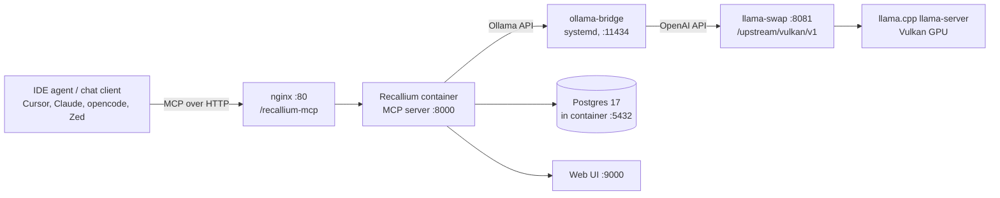

# Recallium on zen3-nixos

[Recallium](https://github.com/recallium-ai/recallium) is a self-hosted memory
server for AI agents: an MCP server + web UI + Postgres that stores what you
and your agents learn, then serves it back through semantic search. This box
runs the `recalliumai/recallium:latest` container and drives its LLM
processing with the **local llama.cpp instance** (via llama-swap) — no cloud
APIs involved.

- **UI:** `http://192.168.49.50:9001` or `http://192.168.49.50/recallium/`
- **MCP endpoint:** `http://192.168.49.50/recallium-mcp` (Streamable HTTP, protocol 2025-11-25)
- **REST API:** `http://127.0.0.1:8001/api/...` (direct) or `:8001` from the box

---

## Architecture



- **`ollama-bridge`** — in-repo Rust app (`ollama-bridge/`, packaged in
  `hosts/zen3-nixos/ai.nix`). Translates Ollama's `/api/chat`, `/api/generate`,
  `/api/tags` → llama-swap's OpenAI endpoint. Listens on `0.0.0.0:11434` so the
  rootful podman container can reach it via `host.containers.internal:11434`.
- **Model routing** — llama-swap auto-loads a GGUF by basename from
  `/home/cjdell/Models`. The model name stored in Recallium must be the GGUF
  basename without `.gguf` (e.g. `Qwen3-Coder-REAP-25B-A3B-Rust-Q4_K_M`).
- **Embeddings** — fully offline `nomic-ai/nomic-embed-text-v1.5` (baked into
  the image, embedding config id 1). No external calls ever.
- **Volumes** — `/var/lib/recallium/{data,wal,documents,secrets}` (tmpfiles,
  uid 1000). Container is `autoStart` rootful podman, like `diamcp`.

## Active configuration (as of last change)

| Thing | Value |
| --- | --- |
| LLM provider | ollama → `http://host.containers.internal:11434` (the bridge) |
| LLM model | `Qwen3-Coder-REAP-25B-A3B-Rust-Q4_K_M` (config id 7) |
| Embedding | `nomic-ai/nomic-embed-text-v1.5` (local, 768-dim, config id 1) |
| Ports | 8001→:8000 MCP · 9001→:9000 UI · 5433→:5432 Postgres |

`GET /api/setup/status` shows `completed: true, active_llm_config_id: 7`.

---

## Connecting clients (MCP)

Point any MCP-capable client at the LAN URL. Everything goes through nginx on
port 80, so no per-machine tunnel is needed:

```json
{
  "mcpServers": {
    "recallium": {
      "url": "http://192.168.49.50/recallium-mcp"
    }
  }
}
```

- **Cursor:** add to project/global `.mcp.json`.
- **Claude Desktop / Claude Code:** add under `mcpServers` in the config.
- **opencode:** add to `opencode.json` MCP servers.
- **Zed:** context server with the same URL (or `http://127.0.0.1:8001/mcp`
  when running on the box itself).

Verify with:

```sh
curl -s -X POST http://192.168.49.50/recallium-mcp \
  -H 'Content-Type: application/json' -H 'Accept: application/json, text/event-stream' \
  -d '{"jsonrpc":"2.0","id":1,"method":"initialize","params":{"protocolVersion":"2025-11-25","capabilities":{},"clientInfo":{"name":"smoke","version":"1"}}}'
```

The 28 MCP tools include: `store_memory`, `search_memories`, `expand_memories`,
`modify_memory`, `get_rules`, `get_insights`, `session_recap`, `create_task`,
`complete_task`, `start_thinking`, `add_thought`, project CRUD, and more.
`tools/list` returns full schemas with guidance on when to use each tool.

---

## REST quick start (verified commands)

### 1. Create a project

```sh
curl -s -X POST http://127.0.0.1:8001/api/projects/ \
  -H 'Content-Type: application/json' \
  -d '{"name":"my-app","description":"My app","settings":{}}'
```

### 2. Store a memory

> ⚠️ `POST /api/memories/` always answers `500 Internal Server Error` — that is
> a known upstream response-schema bug (the response model requires fields like
> `uuid` that the row doesn't carry). **The row is still created and processed.**
> Ignore the 500 and read the memory back by id.

```sh
curl -s -X POST http://127.0.0.1:8001/api/memories/ \
  -H 'Content-Type: application/json' \
  -d '{"project_id":103,"content":"We moved auth to OAuth2 with refresh tokens. Access tokens live 15m, refresh 30d, stored httpOnly.","memory_type":"decision"}'
# -> {"error":"Internal server error"}   (expected — ignore)

curl -s "http://127.0.0.1:8001/api/memories/?limit=1&order_by=id&order_direction=DESC&project_name=my-app"
```

### 3. Watch it process

```sh
curl -s http://127.0.0.1:8001/api/memories/<id>
```

`processing_status` goes `pending → processing → complete` in ~30 s (first call
after idle is slower — the 15 GB model must load). On completion the row has a
markdown `summary` (bold `**Type: Topic**` header) and `smart_tags`.

### 4. Search

```sh
curl -s "http://127.0.0.1:8001/api/memories/search?query=oauth+refresh+token&project_name=my-app&limit=5"
```

Hybrid semantic/keyword search; each hit carries a `similarity` score.

---

## MCP usage demo (what agents actually do)

```sh
# initialize (any JSON-RPC session starts here)
curl -s -X POST http://127.0.0.1:8001/mcp \
  -H 'Content-Type: application/json' -H 'Accept: application/json, text/event-stream' \
  -d '{"jsonrpc":"2.0","id":1,"method":"initialize","params":{"protocolVersion":"2025-11-25","capabilities":{},"clientInfo":{"name":"demo","version":"1"}}}'

# store a memory
curl -s -X POST http://127.0.0.1:8001/mcp \
  -H 'Content-Type: application/json' -H 'Accept: application/json, text/event-stream' \
  -d '{"jsonrpc":"2.0","id":2,"method":"tools/call","params":{"name":"store_memory","arguments":{"content":"The deploy script is scripts/deploy.sh; run it from the repo root, it requires $DEPLOY_KEY.","project_name":"my-app","memory_type":"learning"}}}'

# search what we know before starting work
curl -s -X POST http://127.0.0.1:8001/mcp \
  -H 'Content-Type: application/json' -H 'Accept: application/json, text/event-stream' \
  -d '{"jsonrpc":"2.0","id":3,"method":"tools/call","params":{"name":"search_memories","arguments":{"query":"how do we deploy?","project_name":"my-app","limit":3}}}'
```

`search_memories` returns a formatted report (summary, tags, relevance with
vector/keyword/tag breakdown) and often suggests `expand_memories` for context.

### Typical agent workflow

1. **On session start:** `get_rules` (project `__global__` holds universal
   guardrails) and `session_recap` ("where did we leave off?").
2. **Before acting on a topic:** `search_memories` to reuse prior decisions.
3. **On finishing a unit of work:** `store_memory` with type
   `feature`/`decision`/`debug`/`learning` — Recallium auto-summarises, tags,
   and embeds it.
4. **Periodically:** `get_insights` (analysis_type `patterns`, `quality`,
   `technical_debt`, …) to surface recurring issues across projects.

---

## Live demo project

`recallium-demo` (project id 103) contains three processed example memories
(ids 1010–1012) — all real facts from this box's setup, stored via the same
APIs above:

| id | type | summary header |
| --- | --- | --- |
| 1010 | decision | **Decision: LLM Serving Architecture on Zen3-NixOS** (llama-swap + OpenAI-compatible endpoint + GGUF basename auto-load) |
| 1011 | debug | **Debug: GGUF Model Loading Failure** (neutrino-8b-fv5 invalid ggml type 44; use Q4_K_M) |
| 1012 | learning | **Learning: LFM2.5-2.6B-Q8_0 PGLoop Issue** (loops on JSON metadata; Qwen3-Coder works) |

Try it in the UI at `http://192.168.49.50/recallium/` (login, open
`recallium-demo`) or:

```sh
curl -s "http://127.0.0.1:8001/api/memories/search?query=model+that+emits+JSON&project_name=recallium-demo&limit=3"
```

---

## Admin / operations

### Changing the LLM model

There is **no API for this** (`PUT /api/providers/llm/{id}` only edits
provider *accounts*). Edit Postgres directly (container has psql):

```sh
sudo podman exec recallium psql -h localhost -U recallium -d recallium_memories
# (password: recallium_password)
```

```sql
-- 1. Register the new model (must match a GGUF basename in /home/cjdell/Models)
INSERT INTO llm_models (provider_name, model_name, input_cost_per_1k, output_cost_per_1k,
                        supports_streaming, supports_function_calling, supports_json_mode,
                        max_context_tokens, max_output_tokens, daily_free_limit, is_free_tier,
                        provider_account_id)
VALUES ('ollama', 'NEW-BASENAME', 0, 0, true, true, false, 128000, 4096, NULL, false, 1)
RETURNING id;

-- 2. Point the active config (id 7) at it
UPDATE llm_provider_configs SET model_id = <new_id>, health_status = NULL, health_error = NULL
WHERE id = 7;
```

Then restart so the provider cache picks it up (data lives in volumes, safe):

```sh
sudo podman restart recallium
```

Sanity-test a candidate model before switching it into Recallium (the metadata
prompt lives at `/tmp/recallium_prompt.txt` if you need it):

```sh
curl -s --max-time 300 -X POST http://127.0.0.1:11434/api/generate \
  -H 'Content-Type: application/json' \
  -d '{"model":"<BASENAME>","prompt":"<full metadata prompt>","stream":false,"options":{"num_predict":700,"temperature":0.1}}'
```

### Restarting / logs

```sh
sudo podman restart recallium
sudo podman logs --tail 100 recallium
```

### DB access

```sh
PGPASSWORD=recallium_password psql -h 127.0.0.1 -p 5433 -U recallium -d recallium_memories
# or from inside: sudo podman exec -it recallium psql -h localhost -U recallium -d recallium_memories
```

---

## Known quirks & troubleshooting

- **MCP server can wedge (upstream bug).** The app's MCP endpoint intermittently
  stops responding to `/mcp` (clients see "context server request timeout"; the
  container may need `SIGKILL` to stop). A systemd watchdog
  (`recallium-healthcheck.timer`, every 2 min) POSTs an `initialize` and
  restarts the container if two consecutive checks fail — it self-heals, but a
  client connected during the wedge must reconnect.
- **CORS for the MCP endpoint is handled at nginx**, not by the app: the
  container's `CORSMiddleware` only permits its fixed `CORS_ORIGINS` list and
  returns 400 to preflights from any other origin. The `/recallium-mcp` nginx
  location answers `OPTIONS` locally and stamps `Access-Control-Allow-Origin`
  (echoing the request origin) on every response, so browser-based MCP clients
  on any origin work. The app-level `CORS_ORIGINS` env only matters when
  hitting `:8001` directly.
- **`POST /api/memories/` returns 500** even on success (missing `uuid`/
  `embedding_model`/`embedding_dimensions` in the response model). The row is
  created; read it back via `GET /api/memories/{id}`.
- **The metadata prompt contains literal `{{` / `}}`** (Recallium's template
  escaping). Well-behaved models copy the doubled braces — Recallium's parser
  tolerates it, so don't "fix" the output.
- **`mcp_tools_enabled: false`** in `/api/setup/status` is cosmetic — the MCP
  server works and all 28 tools are registered.
- **Model must emit JSON reliably.** Tiny models loop forever on the metadata
  prompt: `LFM2.5-2.6B-Q8_0` PGLoops (`PG PG PG…`), ignores token caps, and
  burns CPU for hours. `Qwen3-Coder-REAP-25B-A3B-Rust-Q4_K_M` reliably emits
  valid metadata in ~25 s.
- **Client timeout → zombie generation.** Recallium's Ollama client times out
  at 120 s, but llama.cpp keeps generating after a disconnect. If a model is
  too slow (or loops), you get an orphaned generation chewing CPU. Kill it
  with llama-swap's unload:
  ```sh
  curl -X POST http://127.0.0.1:8081/api/models/unload/<MODEL_BASENAME>
  # or unload everything:
  curl -X POST http://127.0.0.1:8081/api/models/unload
  ```
- **GGUF compatibility.** Some models in `/home/cjdell/Models` use quant
  formats this llama.cpp build can't read (`neutrino-8b-fv5.gguf` →
  `invalid ggml type 44`). Stick to Q4_K_M/Q8_0 era quantisations, or check
  with `llama-cli -m <file> --no-warmup -p x -n 1` before wiring one in.
- **Health checks** hit the bridge through llama-swap: `curl -s -X POST
  http://127.0.0.1:8001/api/providers/health-check -H 'Content-Type:
  application/json' -d '{"provider_account_id":1}'` reports per-provider
  status (the *ollama account* row itself stays `inactive` in that response —
  only the config's `health_status` matters, which sits in
  `llm_provider_configs`).
